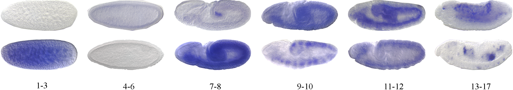

# Deep Low-Shot Learning for Biological Image Classification and Visualization from Small Training Samples

Created by [Lei Cai](https://www.eecs.wsu.edu/~lcai/), and [Shuiwang Ji](http://people.tamu.edu/~sji/index.html).

## Introduction

Deep low-shot learning for precise stage annotation for embryo images. BDGP dataset contains 36908 images with stage range label in which 3474 images are give precise stage label.



We employ deep low-shot learning to annotate the embryo images automatically.


## System requirement

#### Programming language
Python 3.5+

#### Python Packages
Pytorch, numpy

## Training 

#### Train the residual network

```
python main.py --mode=0
```

#### Train the residual network with transfer learning

```
python main.py --mode=1
```

#### Generate reference set

```
python main.py --mode=2
```

#### Fine-tune the network

```
python fintune.py
```

## GEM results


